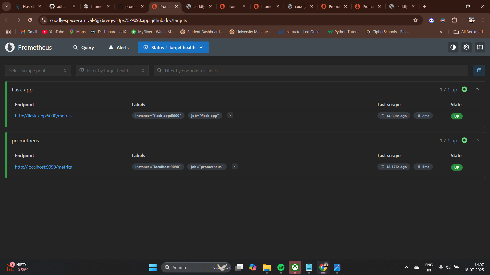
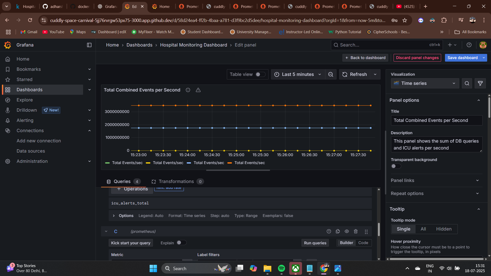

# 🏥 Real-Time Hospital Monitoring System using Docker, Prometheus, Grafana & GitHub Actions

## 📌 Project Overview

This project showcases a **cloud-native monitoring solution** tailored for hospitals using **Prometheus** and **Grafana**, containerized with **Docker** and automated through **GitHub Actions CI/CD**. The system collects, exposes, and visualizes real-time patient or event metrics — simulating how healthcare institutions can monitor infrastructure efficiently.

---

## 🚀 What I Learned

- ⚙️ **Containerization** using Docker (multi-container setup with `docker-compose`)
- 📈 **Monitoring & Observability** using Prometheus exporters and Grafana dashboards
- 🔁 **CI/CD Pipeline** automation via GitHub Actions (YAML workflows)
- 📂 **Infrastructure as Code** practices and best practices in DevOps
- 📊 **Dashboard Design** for real-time metric analysis
- 🐍 **Flask Web App** development and metrics exposure on `/metrics` endpoint
- 🛠️ Git & GitHub repository management

---

## 🧰 Tech Stack

| Layer             | Tools / Tech                          |
|------------------|----------------------------------------|
| **Backend App**   | Python, Flask                         |
| **Monitoring**    | Prometheus (metrics scraping)         |
| **Visualization** | Grafana (time-series dashboards)      |
| **Containerization** | Docker, Docker Compose             |
| **CI/CD**         | GitHub Actions                        |
| **Source Control**| Git, GitHub                           |
| **DevOps Skills** | CI/CD, Monitoring, Docker, YAML       |

---

## 🏗️ Project Structure

hospital-monitoring-docker/
├── app/
│ └── main.py # Flask app exposing /metrics
├── prometheus/
│ └── prometheus.yml # Prometheus scrape config
├── grafana/ # (Optional) Dashboard JSONs
├── .github/
│ └── workflows/
│ └── ci-cd.yml # GitHub Actions pipeline
├── docker-compose.yml
├── Dockerfile
└── README.md

## ⚙️ Run the Project Locally

1️⃣ **Clone the repository**

 bash
git clone https://github.com/adharsh277/hospital-monitoring-docker.git
cd hospital-monitoring-docker

## 2️⃣ Start services with Docker Compose

bash
Copy
Edit
docker-compose up --build
Flask App: http://localhost:5000/metrics

Prometheus: http://localhost:9090

Grafana: http://localhost:3000 (Login: admin / admin)

## 3️⃣ Import Dashboard in Grafana

Connect Prometheus as data source

Import pre-built dashboard JSON or create your own panels

## 🔁 GitHub Actions CI/CD
Automated GitHub Actions pipeline:

Triggers on push to main

Builds Docker image

(Optional) Pushes to Docker Hub

Runs tests and notifies on success/failure

Workflow file: .github/workflows/ci-cd.yml

📸 Screenshots
📸 Screenshots

---

🔧 **Prometheus Target Configuration**  
This view shows Prometheus successfully scraping metrics from the Flask app.

---

📈 **Grafana Dashboard for Monitoring**  
This is the live Grafana dashboard showing system metrics such as CPU and Memory usage visualized in real-time.

## 🙏 Acknowledgments
Thanks to open-source tools like:

Prometheus

Grafana

Docker

GitHub Actions

## 📚 Future Scope (Optional)
Integrate alerting rules in Prometheus

Push metrics to a central monitoring server

Host the app on a cloud VM using Azure or AWS
